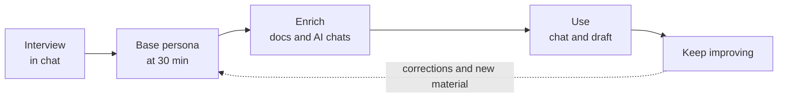
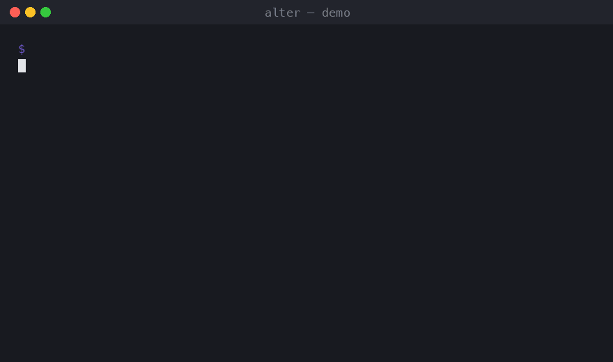
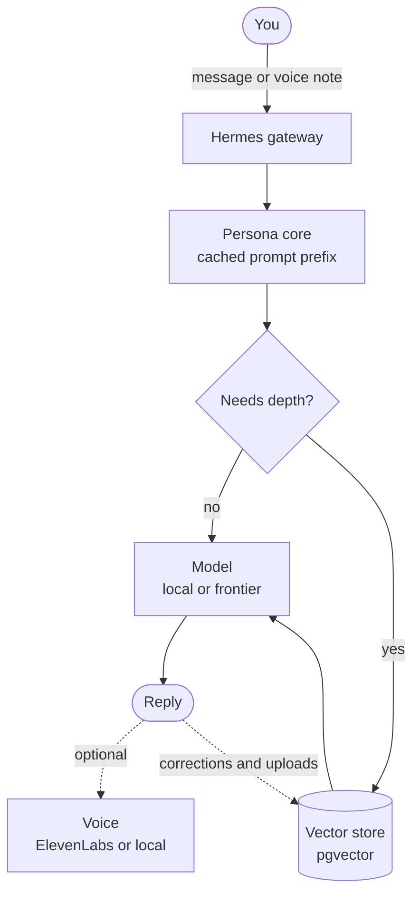

# Alter

**Your alter ego, built from your own words.**


Alter builds a **base persona of you** from a short interview, then **never stops improving it**. As you chat, correct it, and add your own material, the skill **updates its own memory** and sharpens into you. It is an odd, absorbing thing: you are talking to yourself, and teaching yourself as you go. Teach it to swear the way you do, if that is who you are.

**Built on** [Hermes](https://hermes-agent.nousresearch.com) · Postgres + pgvector · Ollama · whisper.cpp · ElevenLabs (optional)



<!-- For extra polish, add a short Telegram demo GIF above:
      -->

---

## How it works

You talk to Alter in your own chat client, such as Telegram. There is no form to fill in. You interview, correct, upload, and check progress in the conversation.

1. **Interview.** Alter asks one question at a time, covering your identity, how you communicate, your work, and your interests. Answer by voice memo or text. Voice is transcribed on your machine. Type `status` for a per-module progress meter and a list of what is outstanding. If you already have recordings, run `bootstrap` to build the persona from them with no interview.
2. **Base persona.** Once you have banked 30 minutes of spoken answers and the core questions, Alter builds the base persona and switches it on. Carry on answering whenever you like. Every answer deepens the persona, and nothing restarts it.
3. **Enrich.** Add writing samples, documents, and exported AI chats from OpenAI or Claude. Alter keeps only your words, removes everyone else's, and redacts secrets before storing. It tells you what each upload taught it.
4. **Use.** Alter answers as you would and drafts your messages and emails in your voice. It can search the web, fetch pages, and run your platform's skills.
5. **Keep improving.** Alter updates its own memory as you talk. Correct a reply and it changes on the next turn, then keeps the fix. When new information clashes with old, it asks instead of overwriting, so the fuller answer wins rather than the most recent one. Say `remember this:` to lock something in. Ordinary chat fades after a few hours, and eight sealed questions stay out of memory so you can always test it against the real you.

---

## Runs on Hermes

Alter is a skill for [Hermes](https://hermes-agent.nousresearch.com), the self-improving agent from Nous Research. Hermes handles the chat surfaces, the model routing, and its own memory. Alter is the persona that sits on top.

| Layer | What you get |
| --- | --- |
| **Model** | Model-agnostic. Build with a frontier model, through your own OpenAI, Anthropic, or OpenRouter key or Nous Portal, for the sharpest persona. Run the live persona on a local model through Ollama to keep generation on your machine. Start local and rebuild under a stronger model later, since your raw material is kept. |
| **Surfaces** | One agent, one memory, many channels: CLI, Telegram, Discord, Slack, WhatsApp, Signal, and more. It is the same persona everywhere. |
| **Integrations** | Slot-in tools and services. Voice is the first, and others connect the same way through Hermes tools and plugins. |
| **Your data** | The persona corpus lives in your local database, and Hermes keeps its own config and memory under `~/.hermes`. Nothing about you goes to a service the author runs, because there is no such service. |

> [!NOTE]
> Where your data goes depends on the model you pick. A local model keeps every token on your machine. A frontier model runs under your own API key and sends prompt content to that provider. Either way, your persona corpus stays in your local database.

---

## Architecture

A message arrives on any surface. The persona core sits in the cached prompt prefix, so every reply is shaped by your style and values at no retrieval cost. A gate decides whether the turn needs depth and, only when it does, pulls a few short chunks from your vector store. The model then composes the reply, voice is optional, and your corrections and uploads write back into the store.



---

## Voice

Alter replies in text by default. Turn voice on and it replies in your cloned voice, built from the memos you recorded during the interview. You can also ask it to read anything aloud.

| Provider | Quality | Runs locally | Notes |
| --- | --- | --- | --- |
| **ElevenLabs** | Highest | No | Your own key and your own clone. Your account, never ours. |
| **Local model** | A step below clone parity today | Yes | No key, no cloud, and Alter is honest about the gap. |

Voice is generated after the text reply has already been sent, so it never slows the conversation. If it fails, Alter falls back to text.

> [!WARNING]
> Only clone your own voice. A public-facing persona that speaks in a real person's voice should disclose that it is a persona.

---

## Setup

### 1. Postgres

```bash
docker-compose up -d
```

Starts Postgres 16 on `127.0.0.1:5433` (5433, not 5432, to avoid colliding
with any existing local Postgres).

### 2. Environment

```bash
cp .env.example .env
```

`DATABASE_URL` in the example already matches the docker-compose defaults.

### 3. Database and questions

```bash
npm install
npx prisma migrate dev
npm run db:seed
```

The seed builds the four-module curriculum from `src/curriculum/curriculum.ts`:
Identity and values, Communication situations, Work and craft, and Interests
and passions. It interleaves the 20-item Mini-IPIP (Donnellan et al., 2006;
public domain, ipip.ori.org) and places the eight sealed validation questions
last. (`voice-personality-intake.md` is generated documentation, not an
input.) Swapping in the 120-item IPIP-NEO later is a seed-only change: replace
`LIKERT_ITEMS` in `prisma/seed.ts` and re-run.

### 4. whisper.cpp (default transcriber)

whisper.cpp is the fastest local option on Apple Silicon because it runs on
Metal (and the Neural Engine via Core ML).

```bash
# Build with Metal (on by default on macOS) — Core ML optional but faster:
git clone https://github.com/ggml-org/whisper.cpp
cd whisper.cpp
cmake -B build -DWHISPER_COREML=1
cmake --build build -j --config Release

# Download a model — large-v3-turbo recommended (or large-v3 for max accuracy):
./models/download-ggml-model.sh large-v3-turbo
```

Then set in `.env`:

```
WHISPER_CLI_PATH=/path/to/whisper.cpp/build/bin/whisper-cli
WHISPER_MODEL_PATH=/path/to/whisper.cpp/models/ggml-large-v3-turbo.bin
```

ffmpeg is required to convert browser webm/opus recordings to the 16 kHz WAV
that whisper.cpp expects:

```bash
brew install ffmpeg
```

(If ffmpeg isn't on PATH, set `FFMPEG_PATH` in `.env`.)

### 5. Run

```bash
npm run dev
```

Open http://localhost:3000, start a labelled session, and grant microphone
access when prompted. Use Chrome for `audio/webm;codecs=opus` recording
(Safari falls back to `audio/mp4`, which is also supported end to end).

---

## Transcription providers

Selected by the `TRANSCRIBER` env var:

| Provider | How it works |
| --- | --- |
| `whisper_cpp` (default) | Invokes the `whisper-cli` binary on each saved recording. `transcriptSource` records the model used, for example `whisper.cpp:large-v3-turbo`. |
| `openai_compatible` | POSTs the audio to `WHISPER_HTTP_URL` (an OpenAI-style `/v1/audio/transcriptions` endpoint). Point the same interface at a local faster-whisper server or a future local audio-capable model without changing app code. Keep the URL on localhost to preserve the no-third-party-calls guarantee. |

> [!NOTE]
> Ollama and typical local multimodal models handle text and images, not
> speech, so transcription runs through Whisper by default. The
> OpenAI-compatible provider is the hook for wiring in an audio-capable model
> if you have one.

Transcription is asynchronous: saving a recording marks it `pending` and a
background worker (single concurrency, resumed automatically on server
restart) fills in the transcript. Recording is never blocked. Failed jobs show
a Retry button. Editing a transcript in the UI flags it
`transcriptEditedByUser`. Your corrected text is the ground truth and is never
overwritten by the transcriber.

---

## Durability and resume

- Every answer is upserted on `(sessionId, questionId)` the moment it is
  saved. Re-answering updates in place, and a refresh or crash loses nothing.
- Re-recording writes the new file to a temp name and atomically renames it
  over the old one, so the previous take is never destroyed until the
  replacement is safely on disk. Re-recording re-queues transcription.
- Reopening a session resumes at the first unanswered question. Skipped
  questions stay visible (amber) in the index grid so you can see what
  remains.

---

## Export

From the session overview (or the home page): downloads a zip containing
`manifest.json` plus every audio file. The manifest lists each question with
its section, type, prompt, `oceanDomain`, `reverseScored`, `isValidation`,
audio filename, duration, transcript, `transcriptSource`,
`transcriptEditedByUser`, `transcriptStatus`, and `likertValue`, along with
session metadata and the combined voice-audio duration, so you can confirm you
have cleared the 30-minute floor for professional voice cloning (1 to 2 hours
is the ideal range).

---

## Layout

```
prisma/schema.prisma        Session / Question / Response
prisma/seed.ts              Parses voice-personality-intake.md + Mini-IPIP
src/lib/transcriber/        Pluggable transcription providers
src/lib/transcriptionQueue.ts  Background worker (resumes on boot)
src/app/                    Home, interview, API routes
data/audio/{session}/{question}.webm   Recordings (path stored in DB)
```

---

## Corpus pipeline (stage 2)

Sits between intake and persona synthesis. Ingests `sources/` (three
subfolders, re-scannable any time), normalizes into one corpus, and writes the
synthesis contract to `corpus/` + `holdout/`.

```bash
npm run corpus -- build                 # full build
npm run corpus -- build --source work   # rebuild one source (others from cache)
npm run corpus -- build --dry-run       # print report, write nothing
npm run corpus -- build --no-llm        # profile judgment fields = null (offline)
npm run test:corpus                     # parser/processing unit tests
```

| Source | What goes in |
| --- | --- |
| `sources/interview/*.zip` | The intake exports. Edited transcripts are ground truth, and the 8 sealed validation questions go only to `holdout/validation.jsonl`. |
| `sources/chat-export/*.zip` | Assistant data exports (Claude supported, provider interface ready for ChatGPT). Human messages only. |
| `sources/work/` | A drop folder (md/txt/pdf/docx/html/eml). Every file needs an entry in `sources/work/manifest.yaml` (label, domain, sensitivity), or the run fails and names the orphans. |

Outputs: `corpus/private.jsonl` + `corpus/public.jsonl` (physically separate by
sensitivity), `corpus/profile.json` (mechanical fields deterministic; judgment
fields via CORPUS_LLM_* env or null), `corpus/report.md`.

Redaction (keys, SSNs, cards/accounts, emails, phones, street addresses) runs
before anything is stored; near-dups and <15-word chat fragments are dropped;
long items chunk to 200–400 tokens; ids are stable content hashes so re-runs
only change what changed. `corpus/`, `holdout/`, `sources/` are gitignored.

---

## Voice persona (legacy local loop, not in this repo)

An earlier spoken-conversation loop (`voice/talk.sh`: mic → whisper.cpp →
persona skill → local zero-shot voice clone) predates the current voice
pipeline, and its assets are deliberately untracked (personal audio never
ships). It is superseded by in-chat voice notes and the `/talk` page, and kept
here only as a pointer for anyone rebuilding a fully local voice loop.

---

## License

Released under the [Apache License 2.0](LICENSE).

Built by [alter-persona](https://github.com/alter-persona).
