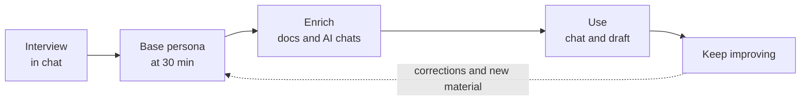

# Alter

**Your alter ego, built from your own words.**


Alter builds a **base persona of you** from a short interview, then **never stops improving it**. As you chat, correct it, and add your own material, the skill **updates its own memory** and sharpens into you. It is an odd, absorbing thing: you are talking to yourself, and teaching yourself as you go. One person taught theirs to swear the way they do.

**Works with** any agent-skills host ([Hermes](https://hermes-agent.nousresearch.com), OpenClaw, Claude Code, Cursor, Codex) · Postgres + pgvector · any OpenAI-compatible model endpoint, local or cloud · whisper.cpp · ElevenLabs (optional)




---

## How it works

You talk to Alter in your own chat client, such as Telegram. There is no form to fill in. You interview, correct, upload, and check progress in the conversation.

1. **Interview.** Alter asks one question at a time, covering your identity, how you communicate, your work, and your interests. Answer by voice memo or text. Voice is transcribed on your machine. Type `status` for a per-module progress meter and a list of what is outstanding. Say `pause` to step out and talk to your persona, `continue interview` to step back in — the interview is never a corridor you're locked in. If you already have recordings, run `bootstrap` to build the persona from them with no interview.
2. **Base persona.** Once you have banked 30 minutes of spoken answers and the core questions, Alter builds the base persona and switches it on. Carry on answering whenever you like. Every answer deepens the persona, and nothing restarts it.
3. **Enrich.** Add writing samples, documents, and exported AI chats from OpenAI or Claude. Alter keeps only your words, removes everyone else's, and redacts secrets before storing. It tells you what each upload taught it.
4. **Use.** Alter answers as you would and drafts your messages and emails in your voice. It can search the web, fetch pages, and run your platform's skills — and with your permission (`ALTER_TOOL_INSTALL=allow`), install new tools from GitHub into its profile when you ask for one it doesn't have.
5. **Keep improving.** Alter updates its own memory as you talk. Correct a reply and it changes on the next turn, then keeps the fix. When new information clashes with old, it asks instead of overwriting, so the fuller answer wins rather than the most recent one. Ordinary chat fades after a few hours; say `remember this:` to lock something in. Eight sealed questions are held out of memory on purpose: once you've answered them and the persona is live, Alter runs the **benchmark** — it answers those same eight cold, judges itself against the real you, and reports the gaps. Say `benchmark` to re-run it anytime; the gaps it names are exactly what your corrections fix.

---

## Runs on any skills host

Alter ships as one `SKILL.md` in the standard [agent skills](https://agentskills.io) layout, so any host that reads the format can load the behavior contract: [Hermes](https://hermes-agent.nousresearch.com) from Nous Research, OpenClaw, Claude Code, Cursor, Codex, and others. The companion services do the heavy work (transcription, embedding, synthesis, the improvement loop) and include their own Telegram adapter, so Alter also runs with no host at all.

| Layer | What you get |
| --- | --- |
| **Model** | Model-agnostic. Point Alter at any OpenAI-compatible endpoint: a local server such as Ollama, LM Studio, or an MLX server keeps every token on your machine; your own OpenAI, Anthropic, or OpenRouter key gives the sharpest synthesis. Start local and rebuild under a stronger model later, since your raw material is kept. |
| **Surfaces** | The built-in Telegram adapter, plus whatever channels your host provides. Hermes, for example, reaches Telegram, Discord, Slack, WhatsApp, Signal, email, and the CLI. It is the same persona everywhere. |
| **Tools** | Web search, page fetch, your host's skills, and voice are built in. Bring your own with one extension file (`ALTER_TOOLS_EXTENSION`), so tools that only make sense on your machine never have to live in this repo. |
| **Your data** | The persona corpus lives in your local database. Nothing about you goes to a service the author runs, because there is no such service. |

> [!NOTE]
> Where your data goes depends on the model you pick. A local model keeps every token on your machine. A frontier model runs under your own API key and sends prompt content to that provider. Either way, your persona corpus stays in your local database.

---

## Try it in five minutes

The repo ships a synthetic persona, Maren Holt, a fictional retired lighthouse keeper who restores valve radios. She needs Node 20 and a model endpoint, nothing else: no database, no whisper, no interview.

```bash
git clone https://github.com/alter-persona/alter.git && cd alter
npm install
npm run demo -- --message "Someone offers you a smart doorbell for free. What do you do with it?"
```

That talks to any OpenAI-compatible endpoint, by default `http://127.0.0.1:11434/v1` (Ollama, LM Studio, and MLX servers all speak it) and the first model it lists. Pass `--url`, `--model`, and `--api-key` for a hosted model, or `--dry-run` to see the assembled prompt: her memory arrives as third-person archivist notes, her voice as a measured fingerprint plus a few short passages, and the two never mix. Run it with no `--message` for a conversation.

---

## Install

The skill is one `SKILL.md` in the standard [agent skills](https://agentskills.io) layout, so it installs into any host that speaks the format. Pick the line that matches yours:

| Host | Command |
| --- | --- |
| Hermes | `hermes skills tap add alter-persona/alter` then `hermes skills install alter-persona/alter/alter` |
| OpenClaw | `clawhub install @jasonquantum/alter` |
| Claude Code, Codex, Cursor, and other coding agents | `npx skills add alter-persona/alter` or `gh skill install alter-persona/alter` |

Hermes can also pull it straight from the well-known endpoint:

```bash
hermes skills install well-known:https://alter-persona.github.io/.well-known/skills/alter
```

Installing the skill gives your agent the behavior contract. The services it drives — database, transcription, corpus — are set up once in [Setup](#setup) below.

---

## Architecture

A message arrives on any surface. The persona core sits in the cached prompt prefix, so every reply is shaped by your style and values at no retrieval cost. A gate decides whether the turn needs depth and, only when it does, pulls a few short chunks from your vector store. The model then composes the reply, voice is optional, and your corrections and uploads write back into the store.


---

## Voice

Alter replies in text by default. Turn voice on and it replies in your cloned voice, built from the memos you recorded during the interview. You can also ask it to read anything aloud.

| Provider | Quality | Runs locally | Notes |
| --- | --- | --- | --- |
| **ElevenLabs** | Highest | No | Your own key and your own clone. Your account, never ours. |
| **Local model** | A step below clone parity today | Yes | No key, no cloud, and Alter is honest about the gap. |

Voice is generated after the text reply has already been sent, so it never slows the conversation. If it fails, Alter falls back to text.

> [!WARNING]
> Only clone your own voice. A public-facing persona that speaks in a real person's voice should disclose that it is a persona.

---

## Setup for the companion services

The skill needs the local services running beside it: Postgres with pgvector, whisper.cpp, ffmpeg, and a model endpoint. The signed pack on the [Releases](https://github.com/alter-persona/alter/releases) page carries an installer that brings a clean machine to a passing health check.

```bash
unzip alter-v0.2.0.zip && cd alter
./bin/install.sh      # checks Node, ffmpeg, whisper.cpp; starts Postgres (Docker); asks your name and build model
./bin/alter health    # every line should be a check mark
./bin/alter status    # phase: interviewing, meter at 0%
```

To build the pack from a clone instead, run `bash pack/build-dist.sh <version>` and install from `dist/alter`.

The installer asks two questions: your name, and the build model. Press Enter for a local endpoint at `http://127.0.0.1:11434/v1` (fully offline, slightly rougher synthesis), or paste an API key for a frontier model. Either way you can change it later and run `./bin/alter rebuild`.

Then talk to it. Set `TELEGRAM_PERSONA_BOT_TOKEN` in `services/.env` and start the adapter with `npm run loop:telegram` inside `services/`, or load `SKILL.md` into your skills host with one of the install lines above. The interview starts on your first message.

Runtime model settings live in the same `.env`: `OLLAMA_URL` (any OpenAI-compatible server that also exposes the native `/api/chat` route, default `http://127.0.0.1:11434`) and `TALK_MODEL` for the reply model. See `pack/QUICKSTART.md` for the first three questions and `pack/PRIVACY.md` for what is stored where.

### Optional: browser recording page

The repo also contains the original browser intake page, a development convenience for recording answers with a microphone instead of chat. It is not needed for the in-chat product.

```bash
docker-compose up -d           # Postgres 16 + pgvector on 127.0.0.1:5433
cp .env.example .env           # DATABASE_URL already matches
npm install
npx prisma migrate dev
npm run db:seed                # builds the four-module curriculum from src/curriculum/curriculum.ts
npm run dev                    # http://localhost:3000
```

whisper.cpp is the default transcriber because it runs on Metal (and the Neural Engine via Core ML) on Apple Silicon. Build it from [ggml-org/whisper.cpp](https://github.com/ggml-org/whisper.cpp), download `large-v3-turbo`, and set `WHISPER_CLI_PATH` and `WHISPER_MODEL_PATH` in `.env`. ffmpeg converts browser recordings to the 16 kHz WAV whisper expects (`brew install ffmpeg`; set `FFMPEG_PATH` if it is not on PATH).

## Transcription providers

Selected by the `TRANSCRIBER` env var:

| Provider | How it works |
| --- | --- |
| `whisper_cpp` (default) | Invokes the `whisper-cli` binary on each saved recording. `transcriptSource` records the model used, for example `whisper.cpp:large-v3-turbo`. |
| `openai_compatible` | POSTs the audio to `WHISPER_HTTP_URL` (an OpenAI-style `/v1/audio/transcriptions` endpoint). Point the same interface at a local faster-whisper server or a future local audio-capable model without changing app code. Keep the URL on localhost to preserve the no-third-party-calls guarantee. |

> [!NOTE]
> Ollama and typical local multimodal models handle text and images, not
> speech, so transcription runs through Whisper by default. The
> OpenAI-compatible provider is the hook for wiring in an audio-capable model
> if you have one.

Transcription is asynchronous: saving a recording marks it `pending` and a
background worker (single concurrency, resumed automatically on server
restart) fills in the transcript. Recording is never blocked. Failed jobs show
a Retry button. Editing a transcript in the UI flags it
`transcriptEditedByUser`. Your corrected text is the ground truth and is never
overwritten by the transcriber.

---

### Durability and resume (browser page)

- Every answer is upserted on `(sessionId, questionId)` the moment it is
  saved. Re-answering updates in place, and a refresh or crash loses nothing.
- Re-recording writes the new file to a temp name and atomically renames it
  over the old one, so the previous take is never destroyed until the
  replacement is safely on disk. Re-recording re-queues transcription.
- Reopening a session resumes at the first unanswered question. Skipped
  questions stay visible (amber) in the index grid so you can see what
  remains.

---

### Export (browser page)

From the session overview (or the home page): downloads a zip containing
`manifest.json` plus every audio file. The manifest lists each question with
its section, type, prompt, `oceanDomain`, `reverseScored`, `isValidation`,
audio filename, duration, transcript, `transcriptSource`,
`transcriptEditedByUser`, `transcriptStatus`, and `likertValue`, along with
session metadata and the combined voice-audio duration, so you can confirm you
have cleared the 30-minute floor for professional voice cloning (1 to 2 hours
is the ideal range).

---

## Layout

```
skills/alter/SKILL.md        The skill: behavior contract in the agent-skills layout
pack/                        Installer, health check, CLI wrapper, docs set, pack build
src/curriculum/              The interview question set (single source of truth)
src/corpus/                  Redaction, chunking, dedup, chat-export and document loaders
src/persona2/                Propositions, style fingerprint, exemplars, prompt, validation
src/loop/                    Improvement loop, sessions, tools, extension point, Telegram adapter
src/understudy/              CLI: bootstrap, status, rebuild, health, evaluate, delete-everything
src/app/                     Browser intake page and playground (optional)
prisma/                      Schema and migrations
tests/                       Five suites: corpus, ingest, persona2, voice, loop
```

## Corpus pipeline (stage 2)

Sits between intake and persona synthesis. Ingests `sources/` (three
subfolders, re-scannable any time), normalizes into one corpus, and writes the
synthesis contract to `corpus/` + `holdout/`.

```bash
npm run corpus -- build                 # full build
npm run corpus -- build --source work   # rebuild one source (others from cache)
npm run corpus -- build --dry-run       # print report, write nothing
npm run corpus -- build --no-llm        # profile judgment fields = null (offline)
npm run test:corpus                     # parser/processing unit tests
```

| Source | What goes in |
| --- | --- |
| `sources/interview/*.zip` | The intake exports. Edited transcripts are ground truth, and the 8 sealed validation questions go only to `holdout/validation.jsonl`. |
| `sources/chat-export/*.zip` | AI chat exports from Claude or OpenAI (ChatGPT). Only your own messages are kept; the assistant's side never enters the corpus. |
| `sources/work/` | A drop folder (md/txt/pdf/docx/html/eml). Every file needs an entry in `sources/work/manifest.yaml` (label, domain, sensitivity), or the run fails and names the orphans. |

Outputs: `corpus/private.jsonl` + `corpus/public.jsonl` (physically separate by
sensitivity), `corpus/profile.json` (mechanical fields deterministic; judgment
fields via CORPUS_LLM_* env or null), `corpus/report.md`.

Redaction (keys, SSNs, cards/accounts, emails, phones, street addresses) runs
before anything is stored; near-dups and <15-word chat fragments are dropped;
long items chunk to 200–400 tokens; ids are stable content hashes so re-runs
only change what changed. `corpus/`, `holdout/`, `sources/` are gitignored.

---

## Voice persona (legacy local loop, not in this repo)

An earlier spoken-conversation loop (`voice/talk.sh`: mic → whisper.cpp →
persona skill → local zero-shot voice clone) predates the current voice
pipeline, and its assets are deliberately untracked (personal audio never
ships). It is superseded by in-chat voice notes and the `/talk` page, and kept
here only as a pointer for anyone rebuilding a fully local voice loop.

---

## License

Released under the [Apache License 2.0](LICENSE).

Built by [alter-persona](https://github.com/alter-persona).
